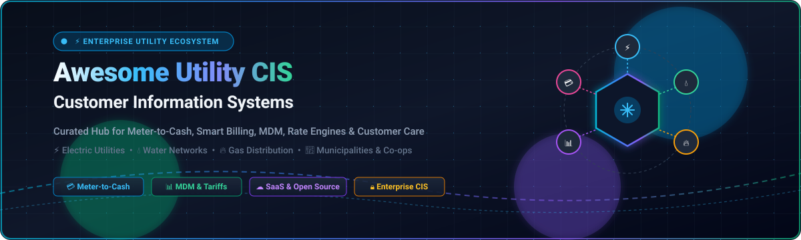

<p align="center">
  
</p>

<p align="center">
  <a href="https://github.com/ishandutta2007/Awesome-Awesome-Awesome"></a>
  <a href="https://discord.gg/jc4xtF58Ve"></a>
  <a href="https://github.com/ishandutta2007/Awesome-Utility-Customer-Information-System/stargazers"></a>
  <a href="https://github.com/ishandutta2007/Awesome-Utility-Customer-Information-System/network/members"></a>
  <a href="https://github.com/ishandutta2007/Awesome-Utility-Customer-Information-System/issues"></a>
  <a href="https://github.com/ishandutta2007/Awesome-Utility-Customer-Information-System/blob/main/LICENSE"></a>
  <a href="https://github.com/ishandutta2007/Awesome-Utility-Customer-Information-System/pulls"></a>
  <a href="https://github.com/ishandutta2007"></a>
</p>

---

# ⚡ Awesome Utility Customer Information System (CIS) Ecosystem 💧 🔥

> A definitive, curated directory of **Enterprise SaaS Platforms**, **Cloud Customer Information Systems (CIS)**, and **Open-Source Rating & Meter-to-Cash Billing Engines** for Electric Power ⚡, Water Distribution 💧, Natural Gas 🔥, District Thermal ❄️, and Smart Municipal Utilities 🏢.

---

## 📖 Overview & Ecosystem Landscape

A **Utility Customer Information System (CIS)** serves as the mission-critical digital backbone for utility service providers, managing:
* 💳 **Meter-to-Cash (M2C)** pipelines & revenue cycle management.
* 📊 **Meter Data Management (MDM)** and Advanced Metering Infrastructure (AMI) interval ingestion.
* 📈 **Complex Tariff & Rate Design** (Time-of-Use [TOU], tiered, demand charges, net-metering).
* 👤 **Customer Care & Account Lifecycle** (onboarding, service transfers, outage communications).
* 📱 **Digital Self-Service Portals** with omni-channel payments and e-billing.
* ⚖️ **Regulatory Compliance & Fiscal Reporting** across regulated investor-owned utilities (IOUs), cooperatives, and municipal utilities.

---

## 📑 Table of Contents
- [🏢 SaaS & Enterprise Hosted Platforms](#-saashosted-platforms)
- [🛠️ Open-Source GitHub Projects](#️-open-source-github-projects)
- [🏗️ Architectural Blueprint for Custom CIS](#-architectural-blueprint-for-custom-cis)
- [⭐ Star History](#-star-history)
- [🤝 How to Contribute](#-how-to-contribute)
- [⚖️ Disclaimer & Compliance](#️-disclaimer--compliance)

---

## 🏢 SaaS/Hosted Platforms

The following enterprise platforms lead the commercial Utility CIS, Billing, and Customer Experience space. Entries are sorted by **Company Scale & Market Valuation / Revenue (descending)**.

| 🏢 Platform / Product | 📈 Company Scale & Revenue / Valuation | 📝 Description & Target Utility | 💰 Specific Starting Pricing | 🎁 Free Tier / Trial Limits |
| :--- | :--- | :--- | :--- | :--- |
| **[Oracle Utilities CC&B / Customer Cloud Service](https://www.oracle.com/utilities/)** | **~$53.0 Billion Revenue**<br>(Market Cap: ~$400B+; Oracle Corp) | Enterprise CIS and meter-to-cash platform supporting complex multi-commodity rates, billing, and high transaction volumes for large IOU and municipal utilities. | Starting at **$15,000/month** ($180,000/year base SaaS tier for mid-sized utilities, or ~$1.50–$3.50 per active meter/year) + cloud infrastructure fees | No permanent free tier; **30-day free trial** via Oracle Cloud Infrastructure ($300 cloud credits, up to 8 OCPUs and 5 TB storage for testing architecture) |
| **[Harris CIS / Customer Solutions](https://www.harriscomputer.com/)** | **~$9.5 Billion Revenue**<br>(Parent: Constellation Software; Harris Group: ~$2.0B+) | Suite of customer information, billing, and meter management solutions serving municipal, cooperative, and mid-to-large multi-service utilities. | Starting at **$5,000/month** ($60,000/year base subscription tier for municipal utilities managing up to 5,000 customer meters) | No permanent free tier; **14-day vendor-assisted interactive demo sandbox** (limited to preloaded municipal tariff templates) |
| **[Cayenta (Harris)](https://www.harriscomputer.com/)** | **~$9.5 Billion Revenue**<br>(Parent: Constellation Software; Harris Group: ~$2.0B+) | Integrated CIS and utility ERP suite popular with municipal and mid-market utilities for complex billing, customer service, and field work orders. | Starting at **$7,500/month** ($90,000/year base SaaS/maintenance tier for small municipal utilities under 5,000 connections; core modules start ~$50,000) | No permanent free tier; **14-day guided proof-of-concept (POC) sandbox** with preconfigured rate models (limited to 5 test users) |
| **[Advanced Utility Systems (CIS Infinity)](https://www.advancedutility.com/)** | **~$9.5 Billion Revenue**<br>(Parent: Constellation Software; Harris Group: ~$2.0B+) | Modular CIS Infinity platform covering meter-to-cash, rate modeling, service orders, and customer engagement for local government and public utilities. | Starting at **$4,200/month** ($50,400/year base tier for 1–10 concurrent users; individual seats priced at ~$3,500/concurrent user one-time + annual hosting) | No permanent free tier; **14-day guided staging trial environment** for municipal billing teams (up to 250 simulated meter endpoints) |
| **[NorthStar Utilities](https://www.northstarutilities.com/)** | **~$9.5 Billion Revenue**<br>(Parent: Constellation Software; Harris Group: ~$2.0B+) | Configurable CIS and billing platform designed for small-to-medium municipal utilities seeking turnkey meter-to-cash and self-service portals. | Starting at **$4,000/month** ($48,000/year base SaaS tier for utilities managing 3,000–10,000 meter connections) | No permanent free tier; **14-day guided POC environment** with sample rate schedules (limited to 3 administrator test seats) |
| **[SilverBlaze](https://www.silverblaze.com/)** | **~$9.5 Billion Revenue**<br>(Parent: Constellation Software; Harris Group: ~$2.0B+) | Customer self-service portal, smart forms, and billing engagement layer that integrates into core CIS and AMI data systems. | Starting at **$2,500/month** ($30,000/year base subscription tier for utility customer portals managing up to 5,000 active users) | No permanent free tier; **14-day interactive portal trial & live demo** with simulated customer login credentials and sample utility e-bills |
| **[Kraken Technologies](https://kraken.tech/)** | **~$9.0 Billion Valuation**<br>($500M+ Annual Contracted ARR; Octopus Energy Group) | Modern AI-driven utility operating system powering end-to-end billing, dynamic tariffs, and grid flexibility for high-growth energy suppliers. | Starting at **$1.20–$1.80 per customer account/month** (minimum platform commitment starting at **$20,000/month**) | No permanent free tier; **30-day enterprise proof-of-concept / API sandbox** for energy retailers (up to 1,000 simulated smart meters) |
| **[Hansen CIS](https://www.hansencx.com/)** | **~$350 Million Revenue**<br>(Market Cap: ~$1.1 Billion; ASX: HSN) | Cloud-native SaaS CIS focusing on digital customer experience, automated service workflows, and AI-enabled meter-to-cash for electric, water, and gas providers. | Starting at **$10,000/month** ($120,000/year base SaaS subscription for small-to-mid utilities up to 10,000 active service accounts) | No permanent free tier; **30-day guided POC trial** upon vendor onboarding (restricted to 500 test accounts and 3 admin users) |
| **[Gentrack](https://www.gentrack.com/)** | **~$170 Million Revenue**<br>(Market Cap: ~$850 Million; ASX/NZX: GTK) | High-velocity customer management and billing engine for competitive energy retailers, water providers, and deregulated energy markets. | Starting at **$12,500/month** ($150,000/year base tier for competitive energy & water retailers with up to 15,000 meter endpoints) | No permanent free tier; **30-day structured proof-of-concept (POC)** sandbox for certified utility retailers (up to 1,000 simulated accounts) |
| **[VertexOne](https://www.vertexone.com/)** | **~$120 Million Revenue**<br>(Valuation: ~$450 Million; Chrysalis/PE) | SaaS customer experience and CIS platform providing cloud billing, customer engagement, mobile workforce, and meter data integration for mid-to-large utilities. | Starting at **$8,000/month** ($96,000/year base SaaS tier for mid-size utilities with up to 10,000 active customer accounts) | No permanent free tier; **30-day guided interactive trial sandbox** on AWS/Azure for qualified utilities (up to 250 test customer records) |
| **[Fluentgrid](https://www.fluentgrid.com/)** | **~$65 Million Revenue**<br>(Valuation: ~$200 Million; Fluentgrid Ltd) | Smart utility software suite integrating CIS, AMI smart metering, CRM, and revenue protection for electric, water, and gas distribution utilities. | Starting at **$6,000/month** ($72,000/year base subscription tier for distribution utilities and smart grid rollouts) | No permanent free tier; **30-day trial sandbox** for smart meter billing validation (limited to 500 simulated AMI meters) |
| **[Milsoft CIS](https://www.milsoft.com/)** | **~$35 Million Revenue**<br>(Valuation: ~$100 Million; Milsoft Solutions) | Comprehensive utility CIS, outage management (OMS), and financial software tailored for electric distribution cooperatives and municipal utilities. | Starting at **$3,500/month** ($42,000/year base SaaS subscription for small electric co-ops under 3,000 meters; perpetual licenses from $25,000) | No permanent free tier; **30-day interactive pilot sandbox** for qualified electric cooperatives (limited to 1,000 dummy accounts) |
| **[Utilismart](https://www.utilismart.com/)** | **~$15 Million Revenue**<br>(Valuation: ~$45 Million; Utilismart Corp) | Cloud-based meter data management (MDM) and billing settlement software for municipal utilities, submeterers, and industrial power providers. | Starting at **$3,000/month** ($36,000/year base SaaS tier for interval meter data management and settlement for up to 5,000 meters) | No permanent free tier; **30-day pilot trial** with sample interval meter data ingestion (limited to 100 test meters) |

---

## 🛠️ Open-Source GitHub Projects

Open-source billing engines, rating systems, and utility management extensions provide modular building blocks to construct or customize a CIS architecture. Entries are sorted by **GitHub Star Count (descending)**.

*   **[Lago](https://github.com/getlago/lago)** [](https://github.com/getlago/lago/stargazers)  
    Open-source metering and usage-based billing platform engineered for complex high-volume event rating, real-time consumption tracking, dynamic tariffs, and automated customer invoicing.

*   **[Kill Bill](https://github.com/killbill/killbill)** [](https://github.com/killbill/killbill/stargazers)  
    Enterprise open-source subscription billing, payment management, and financial accounting engine built for high scale, custom rating plugins, and complex multi-gateway payment workflows.

*   **[Flexprice](https://github.com/flexprice/flexprice)** [](https://github.com/flexprice/flexprice/stargazers)  
    Modern open-source usage-based pricing and billing engine featuring real-time meter event ingestion, consumption credits, entitlement management, and self-hosted deployment.

*   **[OpenMeter](https://github.com/openmeterio/openmeter)** [](https://github.com/openmeterio/openmeter/stargazers)  
    Cloud-native real-time metering engine built to process millions of usage events per second, aggregate meter metrics for interval billing, and integrate into utility rating systems.

*   **[FOSSBilling](https://github.com/FOSSBilling/FOSSBilling)** [](https://github.com/FOSSBilling/FOSSBilling/stargazers)  
    Free and open-source billing, client management, and invoice automation software with a modular plugin architecture for payment gateways and service provisioning.

*   **[CGRateS](https://github.com/cgrates/cgrates)** [](https://github.com/cgrates/cgrates/stargazers)  
    Carrier-grade real-time enterprise rating engine and charging system supporting multi-rate mediation, fraud detection, CDR processing, and complex tariff calculations.

*   **[Electricity Billing System](https://github.com/Adarsh9616/Electricity_Billing_System)** [](https://github.com/Adarsh9616/Electricity_Billing_System/stargazers)  
    Open-source desktop and database utility management system automating customer meter reading inputs, unit rate calculations, tariff tiers, and payment status tracking.

*   **[BillRun](https://github.com/BillRun/system)** [](https://github.com/BillRun/system/stargazers)  
    Open-source big-data billing, mediation, and fraud-prevention platform capable of processing massive streams of raw meter and usage CDRs into itemized utility invoices.

*   **[ERPNext Utility Billing](https://github.com/navariltd/utility-billing)** [](https://github.com/navariltd/utility-billing/stargazers)  
    Utility billing and property management extension for ERPNext supporting smart meter readings, water/electric tariff matrices, batch billing, and municipal accounting integration.

*   **[CitrusDB](https://github.com/paulyasi/citrusdb)** [](https://github.com/paulyasi/citrusdb/stargazers)  
    Lightweight open-source customer care, account management, and billing database system designed for managing utility accounts, recurring billing, and service tickets.

---

## 🏗️ Architectural Blueprint for Custom CIS

For municipal utilities, co-ops, or agile energy retailers building a custom, non-proprietary CIS stack, consider the following reference architecture:

```
+-----------------------------------------------------------------------------------+
|                            Customer Touchpoints & Portals                         |
|   (Next.js / Vue / SilverBlaze / Open Self-Service Portal + Mobile Payments)     |
+------------------------------------------+----------------------------------------+
                                           |
+------------------------------------------v----------------------------------------+
|                                API Gateway & CRM Layer                            |
|             (ERPNext / Strapi / Directus / Custom Fastify Core Services)          |
+---------------------+---------------------------------------+---------------------+
                      |                                       |
+---------------------v-------------------+   +---------------v---------------------+
|      Real-Time Metering & Ingestion     |   |       Rating & Billing Engine       |
|      (OpenMeter / Kafka / EMQX)         |   |     (Lago / Kill Bill / Flexprice)  |
+---------------------+-------------------+   +---------------+---------------------+
                      |                                       |
+---------------------v---------------------------------------v---------------------+
|                           General Ledger & Payment Processing                     |
|           (ERPNext Accounts / Stripe / Braintree / ACH / Municipal Gateway)       |
+-----------------------------------------------------------------------------------+
```

---

## ⭐ Star History

[](https://star-history.dera.page/#ishandutta2007/Awesome-Utility-Customer-Information-System&type=date&legend=top-left)

---

## 🤝 How to Contribute

1. 🍴 Fork the repository.
2. 🌿 Create a new feature branch (`git checkout -b feature/add-new-cis-platform`).
3. 📝 Add or edit entries in `README.md` following the existing tabular and list standards (include link, pricing, scale, and stars badge).
4. 🚀 Submit a Pull Request with a clear description of the change.

---

## ⚖️ Disclaimer & Compliance

* This repository is a **community-curated index** for informational and educational purposes; it is not an endorsement of any listed vendor or project.
* Utility CIS platforms manage critical municipal infrastructure, regulated revenue collection, and sensitive customer PII.
* Prior to deploying open-source components in production, ensure strict compliance with regional utility regulatory commissions, PCI-DSS payment standards, FERC/NERC CIP regulations, and local data privacy frameworks (e.g., GDPR, CCPA).

---

<p align="center">
  <b>Built for Utility IT Architects, Billing Engineers &amp; Municipal Leaders exploring modern meter-to-cash systems.</b><br>
  <sub>Maintained with ❤️ by the community. Star ⭐ this repository if you find it helpful!</sub>
</p>
